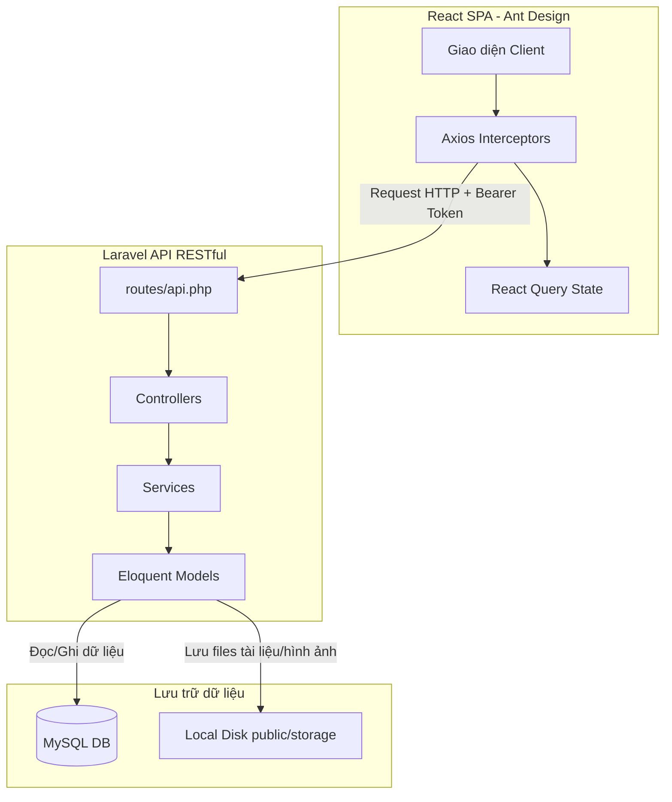

# 📖 Tổng Quan Dự Án Luận Văn Tốt Nghiệp (Trung Nguyên)

Hệ thống được thiết kế để quản lý toàn diện các quy trình trong dự án xây dựng bao gồm: quản lý đối tác, soạn thảo hợp đồng khách hàng/nhà thầu phụ/nhà cung cấp vật tư, phân rã công việc giao khoán (WBS), ghi nhận nhật ký thi công hiện trường hàng ngày, ban quản lý nghiệm thu khối lượng, quản lý thu chi tài chính thực tế và hệ thống thông báo tự động.

---

## 🛠️ 1. Công Nghệ Sử Dụng (Tech Stack)

### 🖥️ Backend (Hệ thống API RESTful)
- **Framework:** Laravel 11.x / 13.x (PHP 8.3+)
- **Xác thực:** Laravel Sanctum (Token-based Authentication)
- **Database:** MySQL
- **Định dạng code:** Laravel Pint
- **Đặc trưng:**
  - Không sử dụng trường `updated_at` trong phần lớn các bảng nghiệp vụ (`const UPDATED_AT = null;`).
  - Sử dụng trường mật khẩu tùy biến `password_hash` thay thế cột `password` mặc định trong bảng `users`.

### 🎨 Frontend (Giao diện SPA)
- **Framework & Công cụ:** React 19.x + Vite 8.x + JavaScript (JSX)
- **Thư viện UI chính:** Ant Design (`antd` v6.x) & `@ant-design/icons`
- **Quản lý & Đồng bộ State:** `@tanstack/react-query` v5.x (React Query)
- **HTTP Client:** `axios` v1.17
- **Định tuyến:** `react-router-dom` v7.x (React Router)
- **Vẽ đồ thị:** `recharts` v3.x

---

## 📐 2. Kiến Trúc Hệ Thống (Architecture)

---

## 🗄️ 3. Sơ Đồ Thực Thể & Model Database (20 Models Core)

Hệ thống có 20 Model Eloquent chính nằm tại thư mục [backend/app/Models](file:///d:/LVTN-TRUNGNGUYEN/LVTN-TRUNGNGUYEN/backend/app/Models):

| STT | Tên Model | Bảng tương ứng | Mô tả |
| :--- | :--- | :--- | :--- |
| 1 | `User` | `users` | Tài khoản đăng nhập chung, chứa `username`, `email`, `password_hash`, `address`. |
| 2 | `Role` | `roles` | Vai trò quyền hạn (`ADMIN`, `SUBCONTRACTOR`, `CUSTOMER`, v.v.). Đã xoá bỏ cột `level`. |
| 3 | `Customer` | `customers` | Đối tác Khách hàng/Chủ đầu tư, quan hệ 1-1 với `User`. Địa chỉ lấy qua `user.address`. |
| 4 | `Subcontractor` | `subcontractors` | Đối tác Nhà thầu phụ thi công. Trạng thái hoạt động dạng `tinyint` (`1` / `0`). |
| 5 | `Project` | `projects` | Dự án xây dựng chính, tính toán ngân sách (`budget`), chi phí dự kiến (`spent_budget`), doanh thu (`received_budget`). |
| 6 | `ProjectCategory` | `project_categories` | Danh mục loại dự án. Không sử dụng `SoftDeletes` (thùng rác). |
| 7 | `ProjectTask` | `project_tasks` | Hạng mục công việc lớn thuộc WBS dự án. Định giá bằng `billing_value` (không gắn với item hợp đồng). |
| 8 | `TaskDetail` | `task_details` | Công việc con được giao khoán chi tiết cho nhà thầu phụ. Quản lý trạng thái thi công & nghiệm thu. |
| 9 | `ClientContract` | `client_contracts` | Hợp đồng ký kết với Khách hàng. Trường giá trị trong DB là `total_value`. |
| 10 | `ContractItem` | `contract_items` | Hạng mục chi tiết hợp đồng khách hàng. Gồm `volume`, `unit_price`, `status` (`active`/`cancelled`). |
| 11 | `ContractAddendum` | `contract_addendums` | Phụ lục điều chỉnh giá trị hợp đồng khách hàng (`value_adjustment`). |
| 12 | `SubContract` | `sub_contracts` | Hợp đồng ký với Nhà thầu phụ. Trường giá trị trong DB là `total_value`. |
| 13 | `DetailContractContractor` | `detail_contract_contractor` | Bảng liên kết một Hợp đồng thầu phụ với một hoặc nhiều nhà thầu phụ liên danh. |
| 14 | `ProjectDocument` | `project_documents` | Quản lý tài liệu hồ sơ dự án. Hỗ trợ xem/tải qua endpoint stream file an toàn. |
| 15 | `DocumentType` | `document_types` | Định nghĩa loại tài liệu hồ sơ (bản vẽ thiết kế, tài liệu pháp lý, v.v.). |
| 16 | `ConstructionLog` | `construction_logs` | Nhật ký thi công hàng ngày. Bỏ các cột nhân công (`labor`) và máy móc (`machinery`). |
| 17 | `ConstructionLogImage` | `construction_log_images` | Lưu trữ hình ảnh thực tế công trường gắn với nhật ký thi công. |
| 18 | `ProjectPayment` | `project_payment` | Phiếu thanh toán Thu (`REVENUE`) và Chi (`COST`). Có cột `payment_code`. |
| 19 | `PaymentTaskDetail` | `payment_task_details` | Bảng phân bổ chi tiết số tiền chi trả từ phiếu chi sang các công việc con của thầu phụ. |
| 20 | `Notification` | `notifications` | Thông báo hệ thống cho các sự kiện nghiệm thu, thanh toán, v.v. |

---

## ⚙️ 4. Các Quy Tắc Nghiệp Vụ Cốt Lõi (Core Business Rules)

### 🔒 Xác thực & Người dùng (Auth)
- Tên cột mật khẩu mặc định của Laravel đã được tùy biến thành `password_hash` và cài casts là `hashed` trong model [User.php](file:///d:/LVTN-TRUNGNGUYEN/LVTN-TRUNGNGUYEN/backend/app/Models/User.php). Hàm `getAuthPasswordName()` trả về `'password_hash'`.
- Trường `username` tự sinh bởi Backend từ email Gmail của khách hàng/thầu phụ khi lưu (không hiển thị ô nhập tay username trên Frontend).
- Định dạng email bắt buộc là `@gmail.com` (không dấu, không chữ hoa) trên toàn bộ biểu mẫu đối tác/tài khoản.

### 💾 Chiến lược lưu trữ tệp tin tương đối (Relative Path Strategy)
- Để tránh lỗi liên kết ảnh/tài liệu khi thay đổi tên miền hoặc cổng kết nối giữa các môi trường:
  - Database **chỉ lưu đường dẫn tương đối** (ví dụ: `construction_logs/xyz.jpg`).
  - Tại Model (`ProjectDocument` và `ConstructionLogImage`), sử dụng Accessor (`file_url` hoặc `image_url`) để tự động chuyển thành URL tuyệt đối bằng cách lấy nguồn động từ host của API Request qua `asset('storage/' . $value)`.
  - Có cơ chế lọc thông minh nếu dữ liệu cũ đang chứa `localhost` hoặc URL tĩnh cũ để bóc tách động, tránh broken link.

### 📐 Phân rã công việc (WBS) & Giao khoán
- **Parent Task (Hạng mục lớn):** Không còn liên kết trực tiếp với hạng mục hợp đồng (`contract_item_id`). Hạn mức và trọng số tiến độ được tính dựa vào trường **`billing_value`** tự nhập.
- **Tiến độ Dự án (`progress`):** Được tính bằng trung bình gia quyền (Weighted Average) của tiến độ các hạng mục lớn theo trọng số `billing_value` của hạng mục đó. Nếu tổng `billing_value` bằng 0, fallback về tính trung bình cộng đơn giản.
- **Hủy công việc con dở dang (`TaskDetail`):**
  - Khi một công việc con bị hủy dở dang (ví dụ thầu phụ làm được 40% rồi bị dừng), khối lượng chưa làm sẽ được ghi nhận vào `remaining_work_volume`.
  - Cho phép tạo đầu việc mới "Giao lại" (prefill phần còn lại từ `remaining_work_volume`), đầu việc giao lại này luôn bắt đầu với tiến độ **`0%`**, trạng thái `TODO` và bị khóa các trường đơn giá/khối lượng để không làm lệch tài chính.
  - Công việc gốc đã giao lại sẽ hiển thị trạng thái "Đã giao lại" và bị khóa toàn bộ tính năng Sửa/Xóa/Giao lại tiếp.

### 💰 Tài chính & Phân bổ Thanh toán (Payments)
- **Phiếu thu (Doanh thu):** Bắt buộc liên kết hợp đồng khách hàng. Tổng thu thực tế (đã giải ngân) không vượt quá giá trị thực tế hợp đồng gốc (`actual_value`).
- **Phiếu chi (Chi phí):** Khi lập phiếu chi cho thầu phụ, ban quản lý phải chọn phân bổ giải ngân chi tiết (`allocated_amount`) cho các công việc con đã hoàn thành và được duyệt nghiệm thu (`APPROVED`) thuộc hợp đồng đó. Tổng số tiền phân bổ phải bằng đúng giá trị ghi trên phiếu chi.
- Bất kỳ phiếu thu/chi nào có trạng thái `Đã giải ngân` (`COMPLETED`) sẽ **bị khóa tính năng Xóa** trên giao diện để đảm bảo an toàn dòng tiền.

---

## 🗺️ 5. Bản Đồ API Endpoints (backend/routes/api.php)

Toàn bộ các API được bảo mật bằng Sanctum token (trừ endpoint login):

- **Xác thực (`/api/auth`)**:
  - `POST admin/login` -> Đăng nhập admin
  - `POST customer/login` -> Đăng nhập khách hàng
  - `POST logout` -> Đăng xuất
  - `GET me` -> Lấy thông tin tài khoản hiện tại
  - `POST change-password` -> Đổi mật khẩu
- **Trang chủ & Báo cáo**:
  - `GET dashboard/stats` -> Thống kê KPI, biểu đồ doanh thu/chi phí theo tháng
- **Đối tác & Tài khoản**:
  - `apiResource users` -> Quản lý tài khoản hệ sinh thái
  - `apiResource customers` -> Danh mục Khách hàng
  - `apiResource subcontractors` -> Danh mục Nhà thầu phụ
  - `GET roles` -> Lấy vai trò hệ thống
- **Quản lý Hợp đồng**:
  - `apiResource client-contracts` -> Hợp đồng Khách hàng gốc
  - `apiResource contract-items` -> Hạng mục công việc trong hợp đồng khách hàng
  - `apiResource contract-addendums` -> Phụ lục hợp đồng khách hàng
  - `apiResource sub-contracts` -> Hợp đồng Nhà thầu phụ gốc
  - `apiResource sub-contract-addendums` -> Phụ lục hợp đồng thầu phụ
- **Quản lý Thi công & Nghiệm thu (WBS)**:
  - `apiResource projects` -> Danh mục dự án thi công
  - `apiResource project-tasks` -> Quản lý hạng mục lớn của dự án
  - `apiResource task-details` -> Chi tiết công việc con giao khoán
  - `apiResource construction-logs` -> Nhật ký thi công và hình ảnh công trường
  - `POST task-details/{id}/request-acceptance` -> Thầu phụ yêu cầu nghiệm thu
  - `GET subcontractor/tasks` -> Danh sách công việc của thầu phụ đang đăng nhập
- **Tài chính & Hồ sơ**:
  - `apiResource project-payments` -> Quản lý phiếu thu và phiếu chi giải ngân
  - `apiResource project-documents` -> Kho hồ sơ tài liệu trực tuyến (hỗ trợ stream an toàn qua endpoint `project-documents/{id}/download`)
- **Hệ thống thông báo**:
  - `GET notifications` -> Lấy danh sách thông báo
  - `PUT notifications/{id}/read` -> Đánh dấu một thông báo đã đọc
  - `PUT notifications/read-all` -> Đánh dấu đã đọc toàn bộ

---

## 🖼️ 6. Bản Đồ Định Tuyến Frontend (React Pages)

Các trang nghiệp vụ chính được tổ chức tại thư mục [frontend/src/pages](file:///d:/LVTN-TRUNGNGUYEN/LVTN-TRUNGNGUYEN/frontend/src/pages):

1. **Đăng nhập (`/admin/login`, `/customer/login`)**:
   - Files: `Auth/AdminLogin.jsx`, `Auth/CustomerLogin.jsx`
2. **Bảng phân tích KPI (`/dashboard`)**:
   - File: `Dashboard/Dashboard.jsx` (Hiển thị biểu đồ Recharts, tổng doanh thu & chi phí thực tế)
3. **Quản lý Tài khoản & Nhân sự (`/hr`)**:
   - File: `HR/HRManagement.jsx` (Đặt lại mật khẩu, cấp quyền đối tác)
4. **Quản lý Đối tác (`/customers`, `/partners`)**:
   - Files: `Customer/CustomerManagement.jsx`, `Partner/PartnerManagement.jsx`
5. **Cổng thông tin Khách hàng (`/customer/portal`)**:
   - File: `Customer/CustomerPortal.jsx` (Dành riêng cho chủ đầu tư theo dõi tiến độ dự án, xem hình ảnh công trình và tải tài liệu)
6. **Quản lý Dự án & Sơ đồ WBS (`/projects`, `/projects/:id`)**:
   - Files: `Project/ProjectManagement.jsx`, `Project/ProjectDetail.jsx`
7. **Chi tiết Hạng mục & Ghi Nhật ký (`/projects/:projectId/tasks/:taskId`)**:
   - File: `Project/ProjectTaskDetail.jsx` (Quản lý các công việc con, bộ lọc tìm kiếm, timeline nhật ký thi công)
8. **Màn hình thầu phụ thi công (`/subcontractor/tasks`)**:
   - File: `Project/SubcontractorTasks.jsx` (Layout 2 cột: Danh sách công việc và Timeline ghi nhật ký thi công hiện trường hàng ngày)
9. **Quản lý Hợp đồng (`/contracts`, `/contracts/:id`, `/sub-contracts/:id`, `/material-contracts/:id`)**:
   - Files: `Contract/ContractManagement.jsx`, `Contract/ContractDetail.jsx`, `Contract/SubContractDetail.jsx`, `Contract/MaterialContractDetail.jsx`
10. **Hệ thống Hồ sơ tài liệu (`/documents`)**:
    - File: `Document/DocumentManagement.jsx` (Tải lên nhiều tệp, khóa tài liệu pháp lý/đã liên kết hợp đồng)
11. **Duyệt nghiệm thu khối lượng (`/acceptances`)**:
    - File: `Acceptance/AcceptanceManagement.jsx` (Admin duyệt/từ chối công việc đạt 100% tiến độ của thầu phụ)
12. **Quản lý Tài chính, Dòng tiền (`/finances`)**:
    - File: `Finance/FinanceManagement.jsx` (Danh sách phiếu thu, phiếu chi phân bổ và sổ công nợ dự án)
